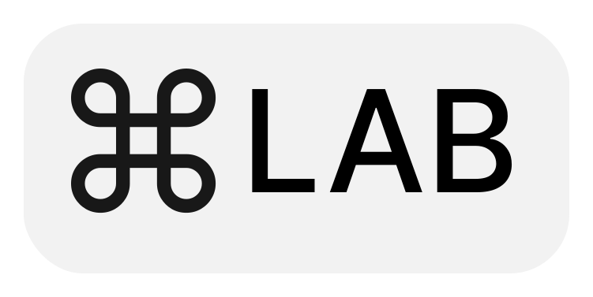

<div align="center">
  
</div>

# CommandLAB

CommandLAB is a testing framework for evaluating AI agents in real computer environments. It provides tools and infrastructure for running agents that can interact with desktop interfaces, applications, and system commands.

## Features

- Interface with the desktop:
  - Obtain the mouse and keyboard states
  - Send mouse and keyboard commands
  - Take screenshots
  - Send/receive microphone/speaker/camera streams ([planned](https://github.com/commandAGI/commandLAB/issues/5))
- Run agents in a containerized environment:

- Work near or far, big or small:
  - Near, Directly control your local desktop
  - commandLAB can spawn docker and Kubernetes containers
- Rich suite of evaluation metrics and testing utilities

## Installation

You can install CommandLAB using pip:

```bash
pip install commandlab
```

Or using Poetry (recommended):

```bash
poetry add commandlab
```

### Optional Dependencies

CommandLAB provides optional dependencies for different use cases:

```bash
# For Docker support
poetry add commandlab[docker]

# For Kubernetes support
poetry add commandlab[kubernetes]
```

## Quick Start

Check out our examples in the `examples/` directory to get started quickly:

```python
from commandlab import Agent

# Initialize an agent
agent = Agent()

# Run a simple desktop automation task
agent.execute("open_browser")
```

## Development

To set up the development environment:

```bash
# Clone the repository
git clone https://github.com/commandagi/commandlab.git
cd commandlab

# Install dependencies with Poetry
poetry install

# Install pre-commit hooks
poetry run pre-commit install
```

## Documentation

For detailed documentation, visit:
- [Official Documentation](https://commandagi.com/developers/commandLAB)
- [API Reference](https://commandagi.com/developers/commandLAB/api)

## License

This project is licensed under the MIT License - see the LICENSE file for details.

## Links

- [Homepage](https://commandagi.com)
- [Documentation](https://commandagi.com/developers/commandLAB)
- [PyPI Package](https://pypi.org/project/commandlab/)
