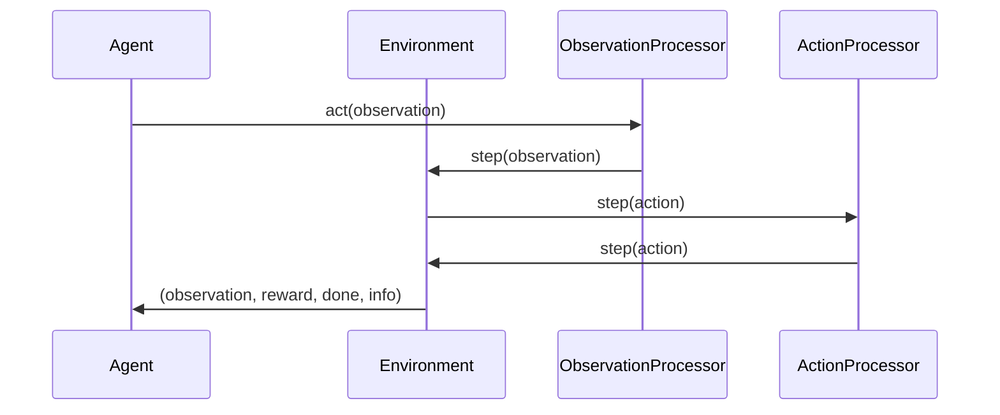

# Concepts

## Computers

Computers are the core abstraction in commandLAB that provide a unified interface for interacting with different computing environments. They handle:

- Screen capture and observation (screenshot)
- Mouse input and state tracking (movement, clicks, scrolling, dragging)
- Keyboard input and state tracking (key presses, hotkeys, typing)
- Command execution (shell commands, timeouts) ([(Coming soon)](https://github.com/commandAGI/commandLAB/issues/5))
- Window management (focus, minimize, maximize) ([(Coming soon)](https://github.com/commandAGI/commandLAB/issues/5))
- Process management (start, stop, monitor) ([(Coming soon)](https://github.com/commandAGI/commandLAB/issues/5))
- Clipboard operations (copy, paste) ([(Coming soon)](https://github.com/commandAGI/commandLAB/issues/5))
- File system operations (read, write, delete) ([(Coming soon)](https://github.com/commandAGI/commandLAB/issues/5))
- Microphone input ([(Coming soon)](https://github.com/commandAGI/commandLAB/issues/5))
- Speaker output ([(Coming soon)](https://github.com/commandAGI/commandLAB/issues/5))

Available computer implementations:

### Base Computer

- `BaseComputer`: Abstract base class defining the computer interface

### Local Computers

- `LocalPyAutoGUIComputer`: Uses PyAutoGUI for local machine control
- `LocalPynputComputer`: Uses Pynput for local machine control with enhanced state tracking

### VNC Computers

- `VNCComputer`: Basic VNC implementation for remote machine control

### Docker-based Computers

- `BaseDockerComputer`: Base implementation for Docker containers
- `VNCDockerComputer`: Docker container with VNC capabilities
- `LXDEVNCDockerComputer`: Docker container with LXDE desktop environment and VNC

### Kubernetes-based Computers

- `BaseKubernetesComputer`: Base implementation for Kubernetes pods
- `VNCKubernetesComputer`: Kubernetes pod with VNC capabilities
- `LXDEVNCKubernetesComputer`: Kubernetes pod with LXDE desktop environment and VNC

### Third-party Integration

- `E2BDesktopComputer`: Integration with E2B Desktop Sandbox

## Environment

Use `ComputerEnv` to wrap a `BaseComputer` in a `BaseEnv`. If you've never used a gym environment before, see [this page](./the-agent-environment-interaction-loop.md) for the basics.

I'll help add a section to the concepts.md file explaining the trainer and driver classes. Here's the addition:

## Trainers and Drivers

CommandLAB provides two key components for managing the training process: Trainers and Drivers.

### Drivers

Drivers handle the interaction between agents and environments, collecting episodes of experience. They abstract away the mechanics of running episodes, offering different execution strategies:

- `SimpleDriver`: Runs episodes sequentially in a single thread
- `ThreadedDriver`: Collects episodes in parallel using multiple threads
- `MultiprocessDriver`: Uses multiple processes for CPU-intensive environments

### Trainers

Trainers orchestrate the overall training process, using drivers to collect experience and updating the agent. CommandLAB offers several training strategies:

- `OnlineTrainer`: Updates the agent after each episode
- `OfflineTrainer`: Collects all episodes first, then performs training
- `BatchTrainer`: Trains on batches of episodes, balancing between online and offline approaches

Each trainer automatically tracks training statistics like episode length and total rewards, making it easy to monitor your agent's progress.

Example usage:
```python
driver = SimpleDriver(env, agent)
trainer = OnlineTrainer(driver, agent)
episodes = trainer.train(num_episodes=100)
stats = trainer.get_training_stats()
```

## Processors

Processors are components that modify the observation or action space available to an agent. They work by wrapping the environment and transforming the data that flows between the agent and environment.

There are two main types of processors:

- **ObservationProcessor**: Transforms the observation before it reaches the agent
- **ActionProcessor**: Transforms the action before it reaches the environment

Put in diagram form, this looks like:



### Screen Parser

The Screen Parser is an ObservationProcessor that analyzes screenshots to detect and locate text and UI elements. It adds structured information about screen contents to the observation space.

Available implementations:

- **TesseractScreenParser**: Uses the open-source Tesseract OCR engine to detect text
  - Lightweight and runs locally
  - Best for simple text detection scenarios
  - Requires the `pytesseract` package (`pip install commandLAB[pytesseract]`)

- **ScreenParseAIParser**: Uses the ScreenParse.ai API for advanced screen parsing
  - More accurate text detection and element recognition
  - Handles complex UI layouts and different text styles
  - Requires an API key from ScreenParse.ai
  - Returns normalized coordinates that are converted to pixel values

Both parsers enhance the observation with:

- Text content found on screen
- Bounding boxes for each detected element
- Original screenshot data preserved

Example usage:

```python
from commandLAB.processors.screen_parser import TesseractScreenParser
from commandLAB.environments import ComputerEnv

# Create environment and wrap with screen parser
env = ComputerEnv(computer)
parser = TesseractScreenParser()
env = parser.wrap_env(env)

# Now observations will include parsed screen data
obs = env.get_observation()
for element in obs.parsed_screenshot.elements:
    print(f"Found text '{element.text}' at {element.bounding_box}")
```

### Grid Overlay

Overlays a grid on top of the screen to help agents specify locations. This technique was pioneered by Anthropic to enable Claude to precisely locate and interact with objects on the screen.

### Audio Transcription

[(Coming soon)](https://github.com/commandAGI/commandLAB/issues/7)

### Speech Synthesis

[(Coming soon)](https://github.com/commandAGI/commandLAB/issues/6)

## Other utilities
