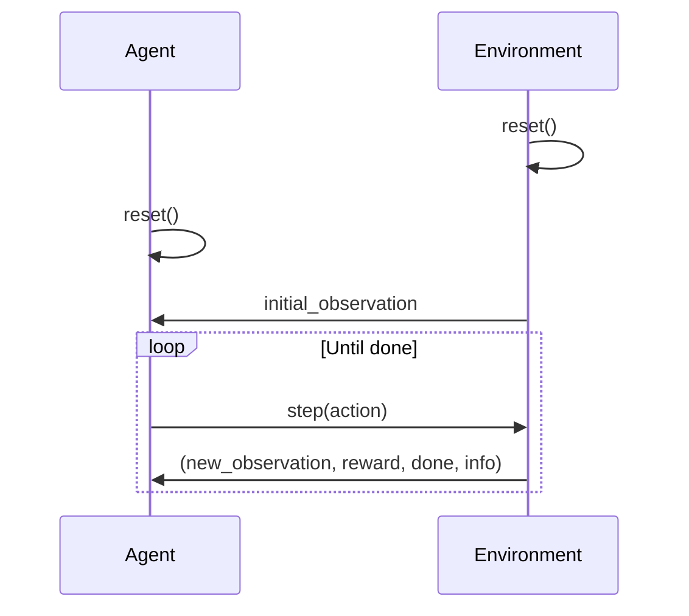

# The Agent-Environment Interaction Loop

I'll help explain the Agent-Environment interface in commandLAB by breaking down how the BaseAgent and BaseEnv classes interact.

The Agent-Environment interface follows a standard reinforcement learning loop pattern:

- The **environment** executes actions and returns the next observation in `BaseEnv.step()`
- The **agent** receives observations and returns actions in `BaseAgent.act()`
- The **environment** also provides rewards and completion status via `BaseEnv.get_reward()` and `BaseEnv.get_done()` and the agent may use this information in `BaseAgent.train()`

Here's a diagram of how they interact:



The key interaction points are:

1. **Environment Reset**:
   - `env.reset()` initializes the environment to a starting state
   - Returns initial observation
   - Clears any previous episode state

2. **Agent Reset**:
   - `agent.reset()` prepares the agent for a new episode
   - Clears any episode-specific memory or state
   - Called at the start of each new episode

3. **Agent Act**:
   - `agent.act(observation)` returns an action based on the current observation

4. **Environment Step**:
   - `env.step(action)` executes the action and returns the next observation, reward, done, and info
   - we use the traditional gym protocol for steps: (observation, reward, done, info)
        - observation: the next observation from the environment
        - reward: the reward from the environment
        - done: whether the episode is done
        - info: additional information from the environment

**Standard Interaction Loop**:

```python
# Typical interaction loop
env = SomeEnvironment()
agent = SomeAgent()

observation = env.reset()
agent.reset()

while True:
    action = agent.act(observation)
    observation, reward, done, info = env.step(action)
    
    if done:
        break

# Optional: Train agent on the completed episode
agent.train(episode)
```

This interface allows for flexible implementation of both agents and environments while maintaining a consistent interaction pattern. The environment handles all the low-level details of computer interaction, while the agent focuses on decision-making and learning from experiences.